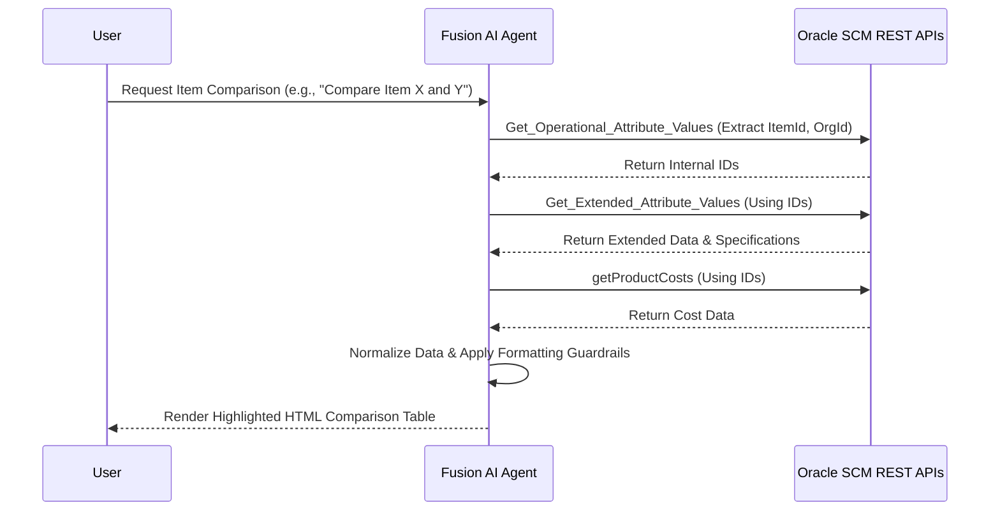

# Oracle Fusion Product Comparison Advisor

> An enterprise-grade AI agent configuration for Oracle Fusion, designed to automate product comparison workflows for Supply Chain Management (SCM).

---

## 📖 Table of Contents
- [Executive Summary](#-executive-summary)
- [Business Value](#-business-value)
- [System Architecture](#-system-architecture)
- [Prerequisites](#-prerequisites)
- [Deployment & Setup](#-deployment--setup)
- [Usage Example](#-usage-example)
- [Software Development Life Cycle](#-software-development-life-cycle-sdlc)

---

## 🏢 Executive Summary
Developed and deployed for **Verdesian Life Sciences**, this repository contains the declarative workflow configuration for the Product Comparison Advisor. The agent accelerates workflows for Product Managers, Designers, and Quality Engineers by automating the extraction, transformation, and comparison of complex product data directly within Oracle Fusion.

## 💼 Business Value
*   **Automated Intelligence:** Eliminates manual data aggregation by directly querying Oracle SCM environments.
*   **Standardized Reporting:** Generates deterministic, dynamically highlighted HTML reports for immediate visual identification of product discrepancies.
*   **Data Integrity:** Employs strict prompt guardrails to prevent data interpolation (hallucinations), ensuring business decisions are made on exact source-of-truth data.

## ⚙️ System Architecture

*   **Inference Engine:** OCI GPT-5 Mini (Oracle Cloud Infrastructure)
*   **Integration Layer:** Oracle Fusion SCM REST APIs
*   **Workflow Format:** Single-Agent Declarative JSON

### Data Flow Sequence

## 📋 Prerequisites
Before deploying this agent, ensure the following requirements are met in your Oracle environment:
*   **Oracle Cloud Infrastructure (OCI)** account with **Fusion AI Agent Studio** provisioned.
*   Active **Supply Chain Management (SCM)** modules (specifically Product Management).
*   A runtime integration user or service account with privileges to query the following REST endpoints:
    *   `/fscmRestApi/resources/11.13.18.05/itemOperationalAttributes`
    *   `/fscmRestApi/resources/11.13.18.05/itemExtendedAttributes`
    *   `/fscmRestApi/resources/11.13.18.05/itemsV2`

## 🚀 Deployment & Setup
This agent configuration is designed to be natively imported and orchestrated via Oracle Fusion AI Agent Studio.

1. Access **Fusion AI Agent Studio** within your Oracle Cloud environment.
2. Navigate to the agent configuration workspace and initialize a new import.
3. Upload the [`PRODUCT_COMPARATOR_V13.json`](./PRODUCT_COMPARATOR_V13.json) file located in the root of this repository.
4. Bind the required SCM REST API credentials to the agent's integration layer.
5. Publish and bind the agent to your target channel or UI interface.

## 💡 Usage Example
Once deployed, users can interact with the agent natively. 

**User Prompt:** 
> *"Compare the operational and extended attributes for Item 10045 and Item 10046. Show only the differences."*

**Agent Response:**
The agent orchestrates the required API calls and outputs a structured HTML table. Any rows where values differ between the two items are automatically highlighted in red (`#ffe6e6`) for immediate visibility.

## 🔄 Software Development Life Cycle (SDLC)
The architecture adheres to a structured, multi-environment deployment strategy:
*   **DEV1 & DEV2 Instances:** System integration testing (SIT), prompt tuning, and HTML rendering validation.
*   **TEST Instance:** User Acceptance Testing (UAT) utilizing real-world enterprise product data from Verdesian Life Sciences to validate accuracy against strict quality assurance metrics.

---
*Disclaimer: This repository contains configuration files and prompts. It does not contain proprietary Oracle source code or sensitive client data.*
