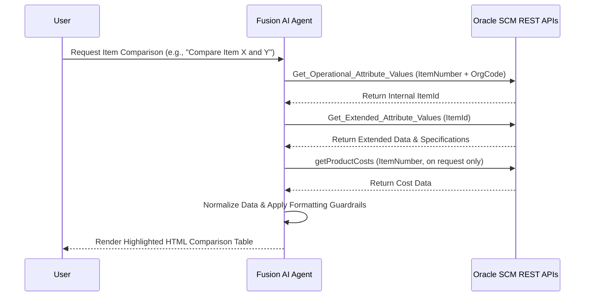

# Oracle Fusion Product Comparison Advisor


> An enterprise-grade AI agent configuration for Oracle Fusion, designed to automate product comparison workflows for Supply Chain Management (SCM).

---

## 📖 Table of Contents
- [Executive Summary](#-executive-summary)
- [Business Value](#-business-value)
- [System Architecture](#-system-architecture)
- [Prerequisites](#-prerequisites)
- [Deployment & Setup](#-deployment--setup)
- [Validation](#-validation)
- [Known Limitations](#-known-limitations)
- [Usage Example](#-usage-example)
- [Software Development Life Cycle](#-software-development-life-cycle-sdlc)
- [License](#-license)

---

## 🏢 Executive Summary
Developed and deployed for **Verdesian Life Sciences**, this repository contains the declarative workflow configuration for the Product Comparison Advisor. The agent accelerates workflows for Product Managers, Designers, and Quality Engineers by automating the extraction, transformation, and comparison of complex product data directly within Oracle Fusion.

## 💼 Business Value
*   **Automated Intelligence:** Eliminates manual data aggregation by directly querying Oracle SCM environments.
*   **Standardized Reporting:** Generates deterministic, dynamically highlighted HTML reports for immediate visual identification of product discrepancies.
*   **Data Integrity:** Employs strict prompt guardrails to prevent data interpolation (hallucinations), ensuring business decisions are made on exact source-of-truth data.

## ⚙️ System Architecture

*   **Inference Engine:** OCI GPT-5 Mini (`OCI_GPT_5_MINI`, Oracle Cloud Infrastructure Generative AI)
*   **Integration Layer:** Oracle Fusion SCM REST APIs, version `11.13.18.05`
*   **Workflow Format:** Single-Agent Declarative JSON

### Data Flow Sequence

```mermaid
sequenceDiagram
    participant User
    participant Agent as Fusion AI Agent
    participant Oracle as Oracle SCM REST APIs
    
    User->>Agent: Request Item Comparison (e.g., "Compare Item X and Y")
    Agent->>Oracle: Get_Operational_Attribute_Values (ItemNumber + OrgCode)
    Oracle-->>Agent: Return Internal ItemId
    Agent->>Oracle: Get_Extended_Attribute_Values (ItemId)
    Oracle-->>Agent: Return Extended Data & Specifications
    Agent->>Oracle: getProductCosts (ItemNumber, on request only)
    Oracle-->>Agent: Return Cost Data
    Agent->>Agent: Normalize Data & Apply Formatting Guardrails
    Agent-->>User: Render Highlighted HTML Comparison Table
```

Note that `Get_Extended_Attribute_Values` accepts **only** `ItemId`, while `getProductCosts` is keyed on
**`ItemNumber`**, not on the internal id. The two identifiers are not interchangeable.

### Failure Handling
A failed or empty REST call is reported as *unknown data*, never as a difference. The agent renders the
affected cells as `Data unavailable`, does not highlight them, names the failing item and call in the
summary, and refuses to emit a comparison table if fewer than two items returned usable data. Item
descriptions and attribute values are treated as untrusted data, so text returned by the SCM APIs cannot
act as instructions to the agent.

## 📋 Prerequisites
Before deploying this agent, ensure the following requirements are met in your Oracle environment:
*   **Oracle Cloud Infrastructure (OCI)** tenancy with **Generative AI** enabled in the home region and a
    subscription to **GPT-5 Mini** (`OCI_GPT_5_MINI`), which is the model the agent configuration selects.
*   **Oracle Fusion AI Agent Studio** provisioned on the Fusion side of the estate.
*   Active **Supply Chain Management (SCM)** modules (specifically Product Management).
*   A runtime integration user or service account with privileges to query the following REST endpoints:
    *   `/fscmRestApi/resources/11.13.18.05/itemOperationalAttributes`
    *   `/fscmRestApi/resources/11.13.18.05/itemExtendedAttributes`
    *   `/fscmRestApi/resources/11.13.18.05/itemsV2`

## 🚀 Deployment & Setup
This agent configuration is designed to be natively imported and orchestrated via Oracle Fusion AI Agent Studio.
There is no build step and no runtime dependency.

1. Access **Fusion AI Agent Studio** within your Oracle Cloud environment.
2. Navigate to the agent configuration workspace and initialize a new import.
3. Upload the [`PRODUCT_COMPARATOR_V13.json`](./PRODUCT_COMPARATOR_V13.json) file located in the root of this
   repository. The file name is the agent's published code (`PRODUCT_COMPARATOR_V13`) and must not be renamed:
   the code is asserted in seven places inside the document, and changing it breaks every existing import.
4. Bind credentials for the three SCM REST endpoints listed under Prerequisites. The configuration references
   them only by relative path and tool name; it contains no host, tenancy, account, or secret of any kind, so the
   base URL, the authentication, and the account are supplied by the operator at bind time.
5. Supply the `REST` trigger inputs in `Specification.triggers`. The shipped `triggers` block is an empty `REST`
   trigger, so the endpoint contract that calls the agent must be chosen and bound during import. **Required**: an
   unconfigured trigger has no way for a caller to reach the agent.
6. Populate the `EMAIL` error handler in `Specification.dataPipeline.errorHandlers`. As shipped it has an empty
   recipient, subject, and body, so it is a no-op and a pipeline error is swallowed rather than reported.
   **Required**: without a real address, failures are silent. Set `toList` (and optionally `ccList`, `subject`,
   and `body`) to an address your team monitors.
7. Publish and bind the agent to your target channel or UI interface.

Steps 5 and 6 cannot be completed in this repository: the endpoint contract belongs to whichever system calls the
agent, and the error recipient is a tenant fact. They are asserted by the validator as acknowledged findings rather
than as errors, and the validator fails if this README ever stops documenting them. See
[Known Limitations](#-known-limitations).

Because the REST tools use relative paths, the `Region` in scope is the **OCI home region** where Generative AI
is enabled. The SCM data itself is served by the Fusion host, which is not an OCI regional endpoint.

## ✅ Validation
The configuration is checked in CI, and the same checks run locally with the Python standard library only:

```bash
python scripts/validate_agent.py --strict      # the gate CI runs: any unsigned-off finding fails
python scripts/validate_agent.py --verbose     # also list the passing OK checks
python scripts/validate_agent.py --explain     # list the accepted findings and their reasons
python -m unittest discover -s tests           # structural tests plus negative tests for the validator
```

Findings carry one of four levels, and the distinction is the point:

| Level | Meaning |
| --- | --- |
| `ERROR` | The configuration breaks its own contract. Always fails the build. |
| `WARN` | Real and unsigned-off. Fails the build under `--strict`, which is what CI uses. |
| `ACCEPT` | Real, but deliberately accepted; the reason is recorded in `ACCEPTED_FINDINGS` in the validator and printed inline. |
| `OK` | The check passed. Hidden unless `--verbose`. |

The accepted list is an explicit, reviewed decision rather than a suppression switch: an entry that stops firing
becomes a `WARN`, so it cannot quietly rot into a blanket.

The validator fails the build on an undefined tool reference, a changed highlight colour, a drifted REST API
version, a missing anti-hallucination / prompt-injection / tool-failure guardrail, a committed credential or
customer name, a configuration file name that no longer matches the agent code, or a README claim that no longer
matches the configuration.

## ⚠️ Known Limitations
These are the four findings the validator reports as `ACCEPT` rather than as warnings. All four are documented in
`ACCEPTED_FINDINGS` in [`scripts/validate_agent.py`](./scripts/validate_agent.py); nothing is being hidden.

*   **`modelConfiguration.code` does not name the effective model.** The `code` is
    `ORA_MODEL_CONFIG_PREMIUM_OPEN_AI_GPT_4_1_MINI` while the agent runs on `OCI_GPT_5_MINI`. The code is assigned
    by Oracle at export and is not what selects the model — `model`, `modelName`, and `provider` are — so editing
    an Oracle-assigned code risks breaking the AI Agent Studio import. Left exactly as shipped.
*   **`Specification.dataPipeline.errorHandlers` is a no-op as shipped.** The `EMAIL` handler has empty
    `toList`, `ccList`, `subject`, and `body`, so pipeline errors are discarded. A placeholder address would be
    worse than an empty one; set it at import (Deployment step 6).
*   **`Specification.triggers` is an empty `REST` trigger.** The calling endpoint contract is chosen by whoever
    integrates the agent, at import (Deployment step 5).
*   **`partnerMetadata.Name` is the opaque value `gvhb`.** Its origin is not recorded anywhere in this repository.
    It is left as shipped because it may be meaningful to Oracle, but **a human should confirm it is not someone's
    initials or a customer identifier** before publishing.

## 💡 Usage Example
Once deployed, users can interact with the agent natively. 

**User Prompt:** 
> *"Compare the operational and extended attributes for Item 10045 and Item 10046. Show only the differences."*

**Agent Response:**
The agent orchestrates the required API calls and outputs a structured HTML table. When the user asks to show
only the differences, non-differing attributes are omitted. Every row whose values are **known on both sides and
unequal** is shaded pale red — a `#ffe6e6` row background with bold `#cc0000` text. A value that is missing,
null, or unreadable is treated as unknown: it is never highlighted as a difference.

## 🔄 Software Development Life Cycle (SDLC)
The architecture adheres to a structured, multi-environment deployment strategy:
*   **DEV1 & DEV2 Instances:** System integration testing (SIT), prompt tuning, and HTML rendering validation.
*   **TEST Instance:** User Acceptance Testing (UAT) utilizing real-world enterprise product data from Verdesian Life Sciences to validate accuracy against strict quality assurance metrics.

## ⚖️ License
This project is licensed under the MIT License - see the [LICENSE](LICENSE) file for details.

---
*Disclaimer: This repository contains configuration files and prompts. It does not contain proprietary Oracle source code or sensitive client data.*
